# Machine vs Man: An analysis of Formula One Cars and Drivers
#### By Cooper Hepworth

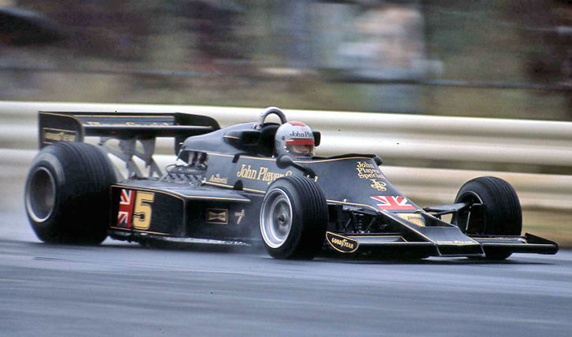

M. Andretti Lotus 78 (Japan 1976) Photographer — Unknown

### **Research Question:** *Is the performance of a Formula One car, concerning time behind the leader, impacted more by the driver's skill or the constructor’s design?*

### **Null Hypothesis:** *The car's impact is more significant than the driver's on determining the time behind the lead racer.*

### Data Source: Ergast Developer API https://ergast.com/mrd/db/#csv

# The Data

## Total Observations
| Group | Unique Count |
| -------- | --------: |
| Drivers | 331 |
| Constructors | 96 |
| Races | 1124 |
| Years | 75 |

## Top 5 Drivers

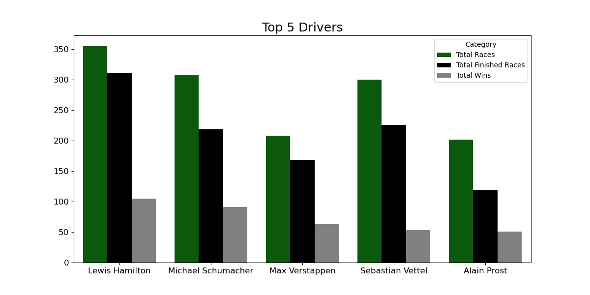

| Driver Name | Total Races | Total Finished Races | Total Wins |
| -------- | :--------: | :--------: | --------: |
| Lewis Hamilton | 355 | 311 | 105 |
| Michael Schumacher | 308 | 219 | 91 |
| Max Verstappen | 208 | 169 | 63 |
| Sebastian Vettel | 300 | 226 | 53 |
| Alain Prost | 202 | 119 | 51 |

## Top 5 Constructors

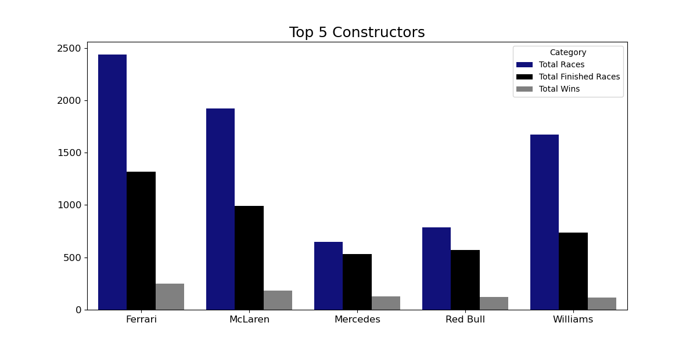

| Constructor Name | Total Races | Total Finished Races | Total Wins |
| -------- | :--------: | :--------: | --------: |
| Ferrari | 2437 | 1319 | 249 |
| McLaren | 1921 | 989 | 184 |
| Mercedes | 650 | 533 | 129 |
| Red Bull | 786 | 568 | 122 |
| Williams | 1674 | 734 | 114 |

## Yearly Data
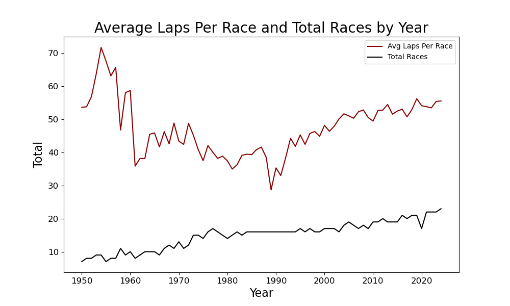

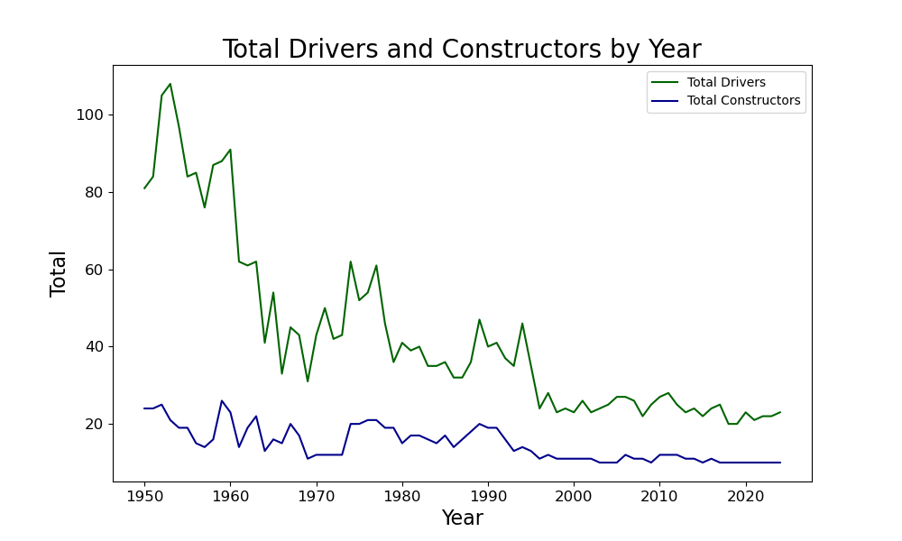

## Unique Combination Data

### The average driver had X unique constructors.

### The average constructor had X unique drivers.

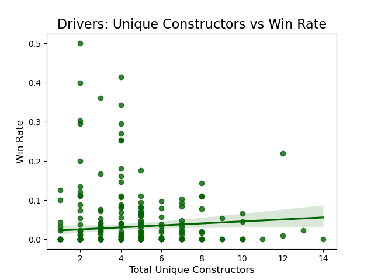

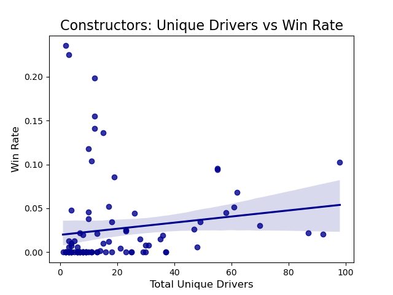

## Mixed Effects Model

### R code to generate mixed effects model

#### `tbl_model_combined <- lmer(tbl ~ 1 + (1 | constructorId) + (1 | driverId), data = f1data)`

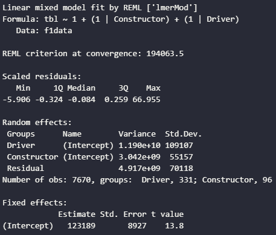

### Differences in Variances
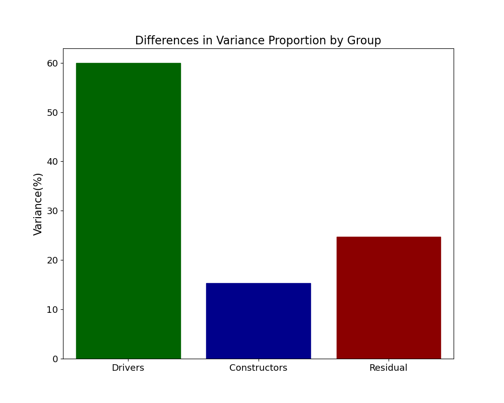

| Group | Variance | Proportion |
| -------- | :--------: | --------: |
| Drivers | 109,1072 | 59.93% |
| Constructors | 55,1572 | 15.32% |
| Residual | 70,1182 | 24.75% |

### Drivers account for almost 4 times the variance that constructors account for. Therefore we reject the null hypothesis.

## Caterpillar Plots

### Drivers
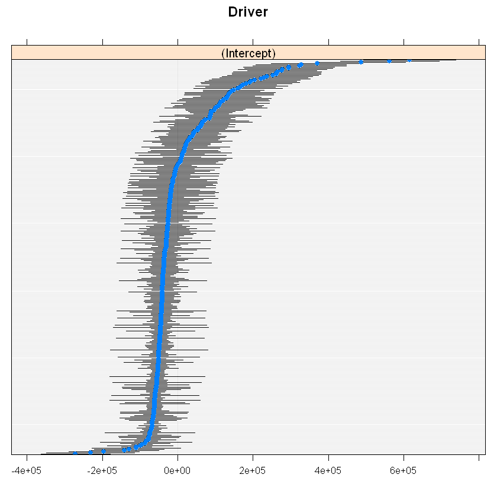

### Constructors
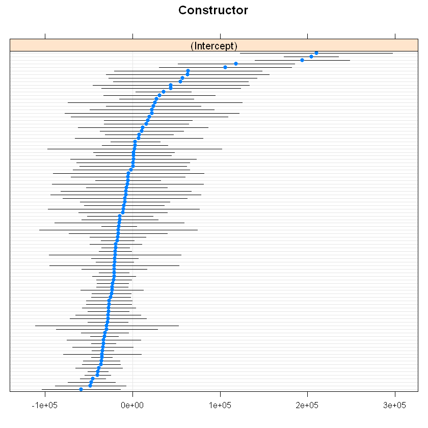